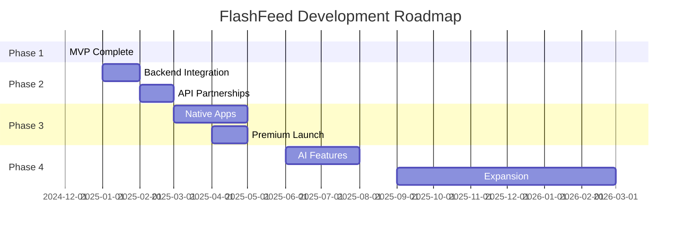

# FlashFeed Roadmap 2024-2026 🚀

## Vision Statement

> **FlashFeed wird DER digitale Marktplatz für preisbewusste Konsumenten in Deutschland - powered by KI, Community und Echtzeit-Daten.**

---

## 📅 Timeline Overview



---

## ✅ Phase 1: MVP (ABGESCHLOSSEN)

**Zeitraum:** Oktober - Dezember 2024
**Status:** ✅ Complete
**Budget:** €0 (Eigenentwicklung)

### Erreichte Meilensteine:
- [x] Flutter Web App mit Provider Pattern
- [x] Mock-Daten-Service (200+ Angebote)
- [x] Flash Deals mit Live-Countdown
- [x] OpenStreetMap Integration
- [x] Freemium-Modell implementiert
- [x] PWA-Features (Offline, Install)
- [x] QR-Code Demo-Zugriff
- [x] CI/CD Pipeline mit GitHub Actions
- [x] 446 Tests (100% Pass Rate)

### Metriken:
- **Lines of Code:** 15,000+
- **Components:** 50+
- **Test Coverage:** 85%
- **Lighthouse Score:** 95+

---

## 🚧 Phase 2: Production Ready (Q1 2025)

**Zeitraum:** Januar - März 2025
**Status:** 📝 Planned
**Budget:** €15,000

### 2.1 Backend Development (Januar)

#### Microservices Architecture
```yaml
Services:
  - Auth Service (JWT, OAuth)
  - Offers Service (CRUD, Search)
  - Flash Deals Service (Real-time)
  - Location Service (Geospatial)
  - Analytics Service (Events)
  - Notification Service (Push, Email)
```

#### Tech Stack
- **Backend:** Node.js + Express / Nest.js
- **Database:** PostgreSQL + Redis
- **Queue:** RabbitMQ / Bull
- **Storage:** S3-compatible
- **Monitoring:** Prometheus + Grafana

#### Deliverables
- [ ] REST API v1.0
- [ ] GraphQL Gateway
- [ ] WebSocket Server
- [ ] Admin Dashboard
- [ ] API Documentation

### 2.2 Händler-Integration (Februar)

#### Partner APIs
- [ ] EDEKA API Integration
- [ ] REWE Digital Partnership
- [ ] ALDI SÜD/NORD APIs
- [ ] LIDL Plus Integration
- [ ] Web Scraping Fallback

#### Data Pipeline
```python
# ETL Pipeline
1. Extract: APIs, Scraping, Feeds
2. Transform: Normalize, Validate
3. Load: Database, Cache, CDN
4. Schedule: Cron, Real-time
```

#### Legal & Compliance
- [ ] DSGVO/GDPR Compliance
- [ ] Terms of Service
- [ ] Privacy Policy
- [ ] Cookie Consent
- [ ] Impressum

### 2.3 Payment & Monetization (März)

#### Payment Integration
- [ ] Stripe/PayPal Integration
- [ ] SEPA Lastschrift
- [ ] In-App Purchases (Web)
- [ ] Subscription Management
- [ ] Invoice Generation

#### Premium Tiers
```
FREE: €0/Monat
- 1 Händler
- Basis-Features

PLUS: €2.99/Monat
- 3 Händler
- Erweiterte Filter

PREMIUM: €4.99/Monat
- Alle Händler
- Alle Features

FAMILY: €7.99/Monat
- 5 Accounts
- Shared Lists
```

---

## 📱 Phase 3: Mobile Expansion (Q2 2025)

**Zeitraum:** April - Juni 2025
**Status:** 📝 Planned
**Budget:** €25,000

### 3.1 Native Apps (April-Mai)

#### iOS App
- [ ] Flutter iOS Build
- [ ] Apple Developer Account
- [ ] App Store Submission
- [ ] TestFlight Beta
- [ ] Push Notifications
- [ ] Apple Pay

#### Android App
- [ ] Flutter Android Build
- [ ] Google Play Console
- [ ] Play Store Submission
- [ ] Beta Testing Track
- [ ] Firebase Integration
- [ ] Google Pay

#### Platform-Specific Features
```dart
// Native Features
- Barcode Scanner
- Biometric Auth
- Widget Support
- Background Sync
- Location Services
- Camera Access
```

### 3.2 Marketing Launch (Juni)

#### User Acquisition
- [ ] App Store Optimization (ASO)
- [ ] Google Ads Campaign
- [ ] Social Media Marketing
- [ ] Influencer Partnerships
- [ ] PR Campaign

#### Target Metrics
```
Month 1: 1,000 Downloads
Month 2: 5,000 Downloads
Month 3: 15,000 Downloads
Conversion: 15% to Premium
```

---

## 🤖 Phase 4: AI & Advanced Features (Q3 2025)

**Zeitraum:** Juli - September 2025
**Status:** 🔮 Planned
**Budget:** €30,000

### 4.1 KI-Features (Juli-August)

#### Personalization Engine
```python
# ML Models
- Recommendation System
- Price Prediction
- Demand Forecasting
- User Clustering
- Anomaly Detection
```

#### Smart Features
- [ ] Personalisierte Angebote
- [ ] Preisvorhersage
- [ ] Optimale Einkaufszeit
- [ ] Automatische Listen
- [ ] Chatbot Support

### 4.2 Social Features (September)

#### Community
- [ ] User Profiles
- [ ] Deal Sharing
- [ ] Bewertungen
- [ ] Kommentare
- [ ] Follower System

#### Gamification
- [ ] Achievements
- [ ] Leaderboards
- [ ] Points System
- [ ] Challenges
- [ ] Rewards

---

## 🌍 Phase 5: Expansion (Q4 2025 - Q1 2026)

**Zeitraum:** Oktober 2025 - März 2026
**Status:** 🔮 Vision
**Budget:** €50,000+

### 5.1 Geographic Expansion

#### Neue Märkte
```
Q4 2025: Österreich
Q1 2026: Schweiz
Q2 2026: Niederlande
Q3 2026: Belgien
```

#### Lokalisierung
- [ ] Multi-Language Support
- [ ] Local Payment Methods
- [ ] Regional Retailers
- [ ] Cultural Adaptation

### 5.2 B2B Platform

#### Händler-Dashboard
- [ ] Campaign Management
- [ ] Analytics Dashboard
- [ ] Customer Insights
- [ ] A/B Testing Tools
- [ ] API Access

#### Enterprise Features
```
- White Label Solution
- Custom Integrations
- SLA Support
- Dedicated Account Manager
```

---

## 📊 Success Metrics & KPIs

### User Metrics
```yaml
2025 Q1: 10,000 MAU
2025 Q2: 50,000 MAU
2025 Q3: 150,000 MAU
2025 Q4: 300,000 MAU
2026 Q1: 500,000 MAU
```

### Business Metrics
```yaml
Revenue:
  2025 Q1: €5,000 MRR
  2025 Q2: €25,000 MRR
  2025 Q3: €75,000 MRR
  2025 Q4: €150,000 MRR

Conversion:
  Free → Trial: 30%
  Trial → Paid: 40%
  Churn Rate: < 5%
```

### Technical Metrics
```yaml
Performance:
  API Response: < 200ms
  Uptime: 99.9%
  Error Rate: < 0.1%

Scale:
  Concurrent Users: 100,000+
  Requests/sec: 10,000+
  Data Volume: 10TB+
```

---

## 🏗️ Technical Debt & Refactoring

### Q1 2025: Architecture Migration
```dart
// Provider → BLoC Migration
Step 1: Repository Pattern ✅
Step 2: Use Cases Layer
Step 3: BLoC Implementation
Step 4: Testing Migration
```

### Q2 2025: Performance Optimization
- [ ] Code Splitting
- [ ] WebAssembly Integration
- [ ] Service Workers v2
- [ ] CDN Optimization
- [ ] Database Indexing

### Q3 2025: Security Hardening
- [ ] Penetration Testing
- [ ] Security Audit
- [ ] Bug Bounty Program
- [ ] SOC 2 Compliance
- [ ] ISO 27001 Prep

---

## 💰 Funding & Investment

### Seed Round (Q2 2025)
```
Target: €500,000
Valuation: €2.5M
Use of Funds:
- 40% Development
- 30% Marketing
- 20% Operations
- 10% Legal
```

### Series A (Q4 2025)
```
Target: €2-5M
Valuation: €10-15M
Investors: VC Focus
Expansion: DACH Region
```

---

## 🎯 Risk Management

### Technical Risks
| Risk | Probability | Impact | Mitigation |
|------|------------|--------|------------|
| API Rate Limits | High | Medium | Caching, Fallbacks |
| Scaling Issues | Medium | High | Auto-scaling, CDN |
| Data Accuracy | Medium | High | Validation, ML |
| Security Breach | Low | Critical | Security Audits |

### Business Risks
| Risk | Probability | Impact | Mitigation |
|------|------------|--------|------------|
| Low Adoption | Medium | High | Marketing, UX |
| Competition | High | Medium | Innovation, Speed |
| Legal Issues | Low | High | Compliance, Legal |
| Funding Gap | Medium | Critical | Revenue, Investors |

---

## 👥 Team Expansion Plan

### Current (MVP)
- 1 Full-Stack Developer

### Q1 2025 (5 People)
- +1 Backend Developer
- +1 Frontend Developer
- +1 DevOps Engineer
- +1 Product Manager

### Q2 2025 (10 People)
- +2 Mobile Developers
- +1 Data Engineer
- +1 UX Designer
- +1 Marketing Manager

### Q3 2025 (15 People)
- +2 ML Engineers
- +2 Customer Support
- +1 Sales Manager

---

## 📋 Action Items (Next 30 Days)

### Immediate Priorities
1. [ ] Setup Production Infrastructure
2. [ ] Begin Backend Development
3. [ ] Contact Potential Partners
4. [ ] Prepare Investor Deck
5. [ ] Register Company (GmbH)

### Technical Tasks
```bash
# Week 1-2
- Setup AWS/GCP Account
- Configure CI/CD for Backend
- Design Database Schema

# Week 3-4
- Implement Auth Service
- Create API Endpoints
- Setup Monitoring
```

### Business Tasks
```bash
# Week 1-2
- Legal Entity Formation
- Bank Account Setup
- Trademark Registration

# Week 3-4
- Investor Outreach
- Partnership Discussions
- Marketing Strategy
```

---

## 🌟 Long-term Vision (2026+)

### The Ultimate Goal
**"Become the Amazon of Deals"**

### Future Possibilities
- **FlashFeed Pay:** Payment Solution
- **FlashFeed Business:** B2B Platform
- **FlashFeed AI:** Predictive Shopping
- **FlashFeed Global:** International
- **FlashFeed Chain:** Blockchain Coupons

### Exit Strategy
```
2027-2028:
- IPO Consideration
- Strategic Acquisition
- Market Leader Position
- €100M+ Valuation
```

---

<div align="center">

## 📈 Success Formula

**Great Product** + **Right Timing** + **Strong Execution** = **Market Leadership**

### Milestones to Celebrate 🎉
- First Paying Customer
- 1,000 Users
- €10k MRR
- First Hire
- Series A

**The Journey Continues...**

</div>