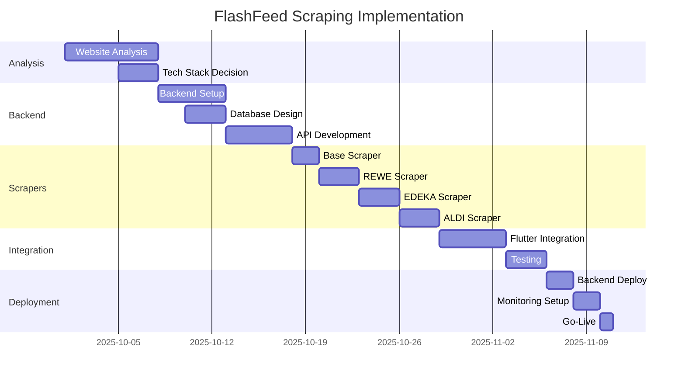

# 🕷️ FlashFeed Web-Scraping Integration - Masterplan

**Projektziel:** FlashFeed von Mock-Daten auf echte, tagesaktuelle Angebote der deutschen LEH-Ketten umstellen

**Timeline:** Nach Uni-Abgabe (Start: Oktober 2025)
**Geschätzter Aufwand:** 4-6 Wochen bei 1-2h/Tag
**Priorität:** Post-MVP Enhancement

---

## 📊 Executive Summary

Transformation von FlashFeed zu einer **echten Preisvergleichs-App** durch:
- Automatisiertes Web-Scraping der großen deutschen LEH-Ketten
- Backend-Service mit Datenbank und API
- Intelligente Caching- und Update-Strategien
- Rechtskonforme Implementierung

---

## 🏗️ Architektur-Übersicht

```
┌─────────────────┐     ┌──────────────────┐     ┌─────────────────┐
│                 │     │                  │     │                 │
│  Flutter App    │────▶│  Backend API     │────▶│  PostgreSQL     │
│  (Frontend)     │◀────│  (Python/Node)   │◀────│  (Database)     │
│                 │     │                  │     │                 │
└─────────────────┘     └──────────────────┘     └─────────────────┘
                               │                          ▲
                               ▼                          │
                    ┌──────────────────┐                 │
                    │                  │                 │
                    │  Scraper Jobs    │─────────────────┘
                    │  (Playwright)    │
                    │                  │
                    └──────────────────┘
                               │
                               ▼
        ┌──────────────────────────────────────────┐
        │         Retailer Websites                │
        │  (REWE, EDEKA, ALDI, LIDL, etc.)        │
        └──────────────────────────────────────────┘
```

---

## 📋 Phase 1: Analyse & Vorbereitung (Woche 1)

### 1.1 Retailer Website-Analyse
**Ziel:** Struktur und Scraping-Möglichkeiten evaluieren

- [ ] **REWE** (rewe.de/angebote)
  - URL-Struktur analysieren
  - HTML-Struktur dokumentieren
  - API-Calls im Network-Tab prüfen
  - robots.txt prüfen
  - Rate Limits identifizieren

- [ ] **EDEKA** (edeka.de/eh/angebote)
  - Regionale Unterschiede beachten
  - JavaScript-Rendering erforderlich?
  - Cookie-Handling nötig?

- [ ] **ALDI SÜD** (aldi-sued.de/angebote)
  - PDF-Prospekte vs. HTML
  - Produktdaten-Struktur
  - Filialfinder-Integration

- [ ] **LIDL** (lidl.de/de/prospekte)
  - Prospekt-API vorhanden?
  - WebSocket-Verbindungen?
  - Captcha-Schutz?

- [ ] **Netto** (netto-online.de/prospekte)
  - Marken-Discount vs. Netto Supermarkt
  - Regional unterschiedliche Angebote

- [ ] **Penny** (penny.de/angebote)
  - REWE-Gruppe Synergie?
  - Ähnliche Struktur wie REWE?

- [ ] **Kaufland** (kaufland.de/angebote)
  - Schwarz-Gruppe Infrastruktur
  - Mögliche API?

### 1.2 Technologie-Stack Entscheidung

**Backend-Sprache:**
- [ ] **Python** (Empfohlen)
  - ✅ BeautifulSoup, Scrapy, Playwright
  - ✅ Große Community
  - ✅ FastAPI für REST API
  - ✅ Celery für Background Jobs

- [ ] **Node.js** (Alternative)
  - ✅ Puppeteer, Playwright
  - ✅ Express/Fastify
  - ✅ Bull für Job Queue
  - ⚠️ Weniger Scraping-Libraries

**Datenbank:**
- [ ] **PostgreSQL** (Empfohlen)
  - Strukturierte Produktdaten
  - JSON-Support für flexible Felder
  - Full-Text-Search

- [ ] **MongoDB** (Alternative)
  - Flexible Schema
  - Gut für unterschiedliche Retailer-Strukturen

### 1.3 Rechtliche Prüfung

- [ ] **robots.txt Analyse** für jeden Retailer
- [ ] **Terms of Service** prüfen
- [ ] **DSGVO-Konformität** sicherstellen
- [ ] **Rate-Limiting-Strategie** definieren
- [ ] **User-Agent Policy** festlegen
- [ ] **Impressumspflicht** für Backend

---

## 🛠️ Phase 2: Backend-Infrastruktur (Woche 2)

### 2.1 Backend Setup

```python
# Projekt-Struktur
flashfeed-backend/
├── app/
│   ├── api/
│   │   ├── __init__.py
│   │   ├── offers.py
│   │   ├── retailers.py
│   │   └── health.py
│   ├── scrapers/
│   │   ├── __init__.py
│   │   ├── base_scraper.py
│   │   ├── rewe_scraper.py
│   │   ├── edeka_scraper.py
│   │   ├── aldi_scraper.py
│   │   └── lidl_scraper.py
│   ├── models/
│   │   ├── __init__.py
│   │   ├── offer.py
│   │   ├── retailer.py
│   │   └── product.py
│   ├── database/
│   │   ├── __init__.py
│   │   ├── connection.py
│   │   └── migrations/
│   └── jobs/
│       ├── __init__.py
│       ├── scheduler.py
│       └── scrape_job.py
├── tests/
├── requirements.txt
├── docker-compose.yml
└── .env.example
```

### 2.2 Database Schema

```sql
-- Retailers Table
CREATE TABLE retailers (
    id UUID PRIMARY KEY DEFAULT gen_random_uuid(),
    name VARCHAR(100) NOT NULL,
    slug VARCHAR(100) UNIQUE NOT NULL,
    logo_url TEXT,
    website_url TEXT,
    scrape_url TEXT,
    is_active BOOLEAN DEFAULT true,
    created_at TIMESTAMP DEFAULT NOW(),
    updated_at TIMESTAMP DEFAULT NOW()
);

-- Products Table
CREATE TABLE products (
    id UUID PRIMARY KEY DEFAULT gen_random_uuid(),
    name VARCHAR(255) NOT NULL,
    brand VARCHAR(100),
    category VARCHAR(100),
    unit VARCHAR(50),
    ean VARCHAR(13),
    created_at TIMESTAMP DEFAULT NOW()
);

-- Offers Table
CREATE TABLE offers (
    id UUID PRIMARY KEY DEFAULT gen_random_uuid(),
    retailer_id UUID REFERENCES retailers(id),
    product_id UUID REFERENCES products(id),
    external_id VARCHAR(255), -- Retailer's product ID
    title VARCHAR(255) NOT NULL,
    description TEXT,
    price DECIMAL(10,2) NOT NULL,
    original_price DECIMAL(10,2),
    discount_percent INTEGER,
    image_url TEXT,
    valid_from DATE,
    valid_until DATE,
    is_flash_deal BOOLEAN DEFAULT false,
    flash_deal_ends_at TIMESTAMP,
    scraped_at TIMESTAMP DEFAULT NOW(),
    created_at TIMESTAMP DEFAULT NOW(),
    UNIQUE(retailer_id, external_id, valid_from)
);

-- Scraping Logs
CREATE TABLE scraping_logs (
    id UUID PRIMARY KEY DEFAULT gen_random_uuid(),
    retailer_id UUID REFERENCES retailers(id),
    status VARCHAR(50), -- 'success', 'failed', 'partial'
    offers_found INTEGER,
    offers_new INTEGER,
    offers_updated INTEGER,
    error_message TEXT,
    duration_ms INTEGER,
    created_at TIMESTAMP DEFAULT NOW()
);

-- Price History (optional für Preisverläufe)
CREATE TABLE price_history (
    id UUID PRIMARY KEY DEFAULT gen_random_uuid(),
    offer_id UUID REFERENCES offers(id),
    price DECIMAL(10,2),
    recorded_at TIMESTAMP DEFAULT NOW()
);
```

### 2.3 API Endpoints

```yaml
# REST API Spezifikation
GET /api/v1/offers
  Query Parameters:
    - retailer: string (comma-separated)
    - category: string
    - search: string
    - min_price: number
    - max_price: number
    - only_discounted: boolean
    - limit: number (default: 50)
    - offset: number

GET /api/v1/offers/{id}

GET /api/v1/retailers
GET /api/v1/retailers/{slug}

GET /api/v1/flash-deals
  Query Parameters:
    - retailer: string
    - ending_soon: boolean (next 30 min)

POST /api/v1/scrape/trigger
  Body:
    - retailer: string
    - force: boolean

GET /api/v1/health
GET /api/v1/stats
```

---

## 🕷️ Phase 3: Scraper-Entwicklung (Woche 3-4)

### 3.1 Base Scraper Klasse

```python
# base_scraper.py
from abc import ABC, abstractmethod
from playwright.async_api import async_playwright
import asyncio
from typing import List, Dict, Any

class BaseScraper(ABC):
    def __init__(self, retailer_name: str):
        self.retailer_name = retailer_name
        self.base_url = None
        self.headers = {
            'User-Agent': 'Mozilla/5.0 (Windows NT 10.0; Win64; x64) AppleWebKit/537.36'
        }

    @abstractmethod
    async def scrape_offers(self) -> List[Dict[str, Any]]:
        """Scrape offers from retailer website"""
        pass

    @abstractmethod
    def parse_offer(self, element) -> Dict[str, Any]:
        """Parse single offer element"""
        pass

    async def get_page_content(self, url: str) -> str:
        """Get page content using Playwright"""
        async with async_playwright() as p:
            browser = await p.chromium.launch(headless=True)
            page = await browser.new_page()
            await page.goto(url, wait_until='networkidle')
            content = await page.content()
            await browser.close()
            return content

    def clean_price(self, price_str: str) -> float:
        """Clean price string to float"""
        # Remove currency symbols, spaces, convert comma to dot
        cleaned = price_str.replace('€','').replace(',','.').strip()
        return float(cleaned)

    def calculate_discount(self, price: float, original: float) -> int:
        """Calculate discount percentage"""
        if original > 0:
            return int(((original - price) / original) * 100)
        return 0
```

### 3.2 REWE Scraper (Beispiel)

```python
# rewe_scraper.py
class REWEScraper(BaseScraper):
    def __init__(self):
        super().__init__("REWE")
        self.base_url = "https://www.rewe.de/angebote/"

    async def scrape_offers(self) -> List[Dict[str, Any]]:
        offers = []

        # Get PLZ-specific URL (Berlin example)
        url = f"{self.base_url}10115/rewe-markt/"
        content = await self.get_page_content(url)

        # Parse with BeautifulSoup
        soup = BeautifulSoup(content, 'html.parser')

        # Find offer elements (needs adjustment based on actual HTML)
        offer_elements = soup.find_all('div', class_='product-offer')

        for element in offer_elements:
            offer = self.parse_offer(element)
            if offer:
                offers.append(offer)

        return offers

    def parse_offer(self, element) -> Dict[str, Any]:
        try:
            # Extract data (pseudo-code, needs real selectors)
            title = element.find('h3', class_='product-title').text.strip()
            price = element.find('span', class_='price').text.strip()
            original = element.find('span', class_='strikethrough-price')
            image = element.find('img')['src']

            offer = {
                'external_id': element.get('data-product-id'),
                'title': title,
                'price': self.clean_price(price),
                'image_url': image,
                'retailer': 'REWE'
            }

            if original:
                offer['original_price'] = self.clean_price(original.text)
                offer['discount_percent'] = self.calculate_discount(
                    offer['price'],
                    offer['original_price']
                )

            return offer
        except Exception as e:
            print(f"Error parsing REWE offer: {e}")
            return None
```

### 3.3 Scraping Job Scheduler

```python
# scheduler.py
from apscheduler.schedulers.asyncio import AsyncIOScheduler
from datetime import datetime
import asyncio

class ScrapingScheduler:
    def __init__(self):
        self.scheduler = AsyncIOScheduler()
        self.scrapers = {
            'rewe': REWEScraper(),
            'edeka': EDEKAScraper(),
            'aldi': ALDIScraper(),
            'lidl': LIDLScraper(),
        }

    def setup_jobs(self):
        # Daily scraping at 6 AM
        self.scheduler.add_job(
            self.scrape_all,
            'cron',
            hour=6,
            minute=0,
            id='daily_scrape'
        )

        # Flash deals every 30 minutes
        self.scheduler.add_job(
            self.scrape_flash_deals,
            'interval',
            minutes=30,
            id='flash_deals_scrape'
        )

    async def scrape_all(self):
        """Scrape all retailers"""
        for name, scraper in self.scrapers.items():
            try:
                print(f"Scraping {name}...")
                offers = await scraper.scrape_offers()
                await self.save_offers(name, offers)
            except Exception as e:
                print(f"Error scraping {name}: {e}")
                await self.log_error(name, str(e))
```

---

## 🔄 Phase 4: Flutter Integration (Woche 5)

### 4.1 Service Layer Update

```dart
// services/real_data_service.dart
class RealDataService {
  static const String baseUrl = 'https://flashfeed-api.herokuapp.com/api/v1';
  final http.Client client = http.Client();

  Future<List<Offer>> getOffers({
    List<String>? retailers,
    String? category,
    String? search,
    bool onlyDiscounted = false,
  }) async {
    final queryParams = {
      if (retailers != null) 'retailer': retailers.join(','),
      if (category != null) 'category': category,
      if (search != null) 'search': search,
      if (onlyDiscounted) 'only_discounted': 'true',
    };

    final uri = Uri.parse('$baseUrl/offers').replace(
      queryParameters: queryParams,
    );

    final response = await client.get(uri);

    if (response.statusCode == 200) {
      final data = json.decode(response.body);
      return (data['offers'] as List)
          .map((json) => Offer.fromJson(json))
          .toList();
    } else {
      throw Exception('Failed to load offers');
    }
  }

  Future<List<FlashDeal>> getFlashDeals() async {
    final response = await client.get(
      Uri.parse('$baseUrl/flash-deals'),
    );

    if (response.statusCode == 200) {
      final data = json.decode(response.body);
      return (data['deals'] as List)
          .map((json) => FlashDeal.fromJson(json))
          .toList();
    } else {
      throw Exception('Failed to load flash deals');
    }
  }

  Stream<List<FlashDeal>> getFlashDealsStream() {
    // WebSocket or polling implementation
    return Stream.periodic(Duration(minutes: 1), (_) {
      return getFlashDeals();
    }).asyncMap((event) => event);
  }
}
```

### 4.2 Provider Migration

```dart
// providers/offers_provider.dart
class OffersProvider extends ChangeNotifier {
  final RealDataService _dataService = RealDataService();
  // Remove MockDataService

  Future<void> loadOffers() async {
    _isLoading = true;
    notifyListeners();

    try {
      // Use real data instead of mock
      _offers = await _dataService.getOffers(
        retailers: _selectedRetailers,
        category: _selectedCategory,
        onlyDiscounted: _showOnlyDiscounted,
      );

      _isLoading = false;
      _errorMessage = null;
    } catch (e) {
      _isLoading = false;
      _errorMessage = 'Fehler beim Laden der Angebote: $e';

      // Fallback to cached data
      _offers = await _loadCachedOffers();
    }

    notifyListeners();
  }
}
```

### 4.3 Caching Strategy

```dart
// services/cache_service.dart
class CacheService {
  static const Duration cacheValidity = Duration(hours: 6);

  Future<void> cacheOffers(List<Offer> offers) async {
    final storage = await LocalStorageService.getInstance();
    final data = {
      'offers': offers.map((o) => o.toJson()).toList(),
      'cachedAt': DateTime.now().toIso8601String(),
    };
    await storage.setString('cached_offers', json.encode(data));
  }

  Future<List<Offer>?> getCachedOffers() async {
    final storage = await LocalStorageService.getInstance();
    final jsonString = storage.getString('cached_offers');

    if (jsonString != null) {
      final data = json.decode(jsonString);
      final cachedAt = DateTime.parse(data['cachedAt']);

      if (DateTime.now().difference(cachedAt) < cacheValidity) {
        return (data['offers'] as List)
            .map((json) => Offer.fromJson(json))
            .toList();
      }
    }
    return null;
  }
}
```

---

## 🚀 Phase 5: Deployment & Operations (Woche 6)

### 5.1 Backend Deployment

**Option 1: Heroku (Einfach)**
```yaml
# heroku.yml
build:
  docker:
    web: Dockerfile
run:
  web: uvicorn app.main:app --host 0.0.0.0 --port $PORT
  worker: celery -A app.jobs worker --loglevel=info
```

**Option 2: Railway.app (Modern)**
```toml
# railway.toml
[build]
builder = "NIXPACKS"

[deploy]
startCommand = "uvicorn app.main:app --host 0.0.0.0 --port $PORT"

[[services]]
name = "worker"
startCommand = "celery -A app.jobs worker"
```

**Option 3: VPS (Volle Kontrolle)**
- Hetzner Cloud (3€/Monat)
- Docker Compose Setup
- Nginx Reverse Proxy
- Let's Encrypt SSL

### 5.2 Database Hosting

- **Supabase** (PostgreSQL, 500MB free)
- **Neon** (PostgreSQL, generous free tier)
- **MongoDB Atlas** (512MB free)

### 5.3 Monitoring & Logging

```python
# monitoring.py
class ScrapingMonitor:
    def track_success_rate(self):
        # Track scraping success/failure
        pass

    def alert_on_failure(self):
        # Send email/Discord notification
        pass

    def performance_metrics(self):
        # Response times, data quality
        pass
```

---

## 🔧 Phase 6: Optimierungen & Erweiterungen

### 6.1 Performance-Optimierungen

- [ ] **Redis Cache** für häufige Anfragen
- [ ] **CDN für Bilder** (Cloudflare)
- [ ] **Database Indexing** optimieren
- [ ] **Pagination** implementieren
- [ ] **Compression** (gzip/brotli)

### 6.2 Erweiterte Features

- [ ] **Preisverlauf-Tracking**
  - Chart für Preisentwicklung
  - Preisalarm bei Wunschpreis

- [ ] **Intelligente Benachrichtigungen**
  - Push bei neuen Angeboten
  - Favoriten-Tracking
  - Preisalarm

- [ ] **Machine Learning**
  - Produkterkennung verbessern
  - Duplikate erkennen
  - Kategorisierung

- [ ] **User Accounts**
  - Favoriten speichern
  - Einkaufslisten
  - Preisalarme

### 6.3 Weitere Retailer

- [ ] **BioCompany**
- [ ] **Norma**
- [ ] **dm**
- [ ] **Rossmann**
- [ ] **Metro** (B2B)

---

## ⚠️ Risiken & Mitigationen

### Technische Risiken

| Risiko | Wahrscheinlichkeit | Impact | Mitigation |
|--------|-------------------|---------|------------|
| Website-Struktur ändert sich | Hoch | Hoch | Robuste Selektoren, Monitoring |
| Rate-Limiting/IP-Ban | Mittel | Hoch | Proxy-Rotation, Rate-Limiting |
| Captcha-Protection | Mittel | Mittel | 2captcha Service, Manual Solving |
| Performance-Probleme | Niedrig | Mittel | Caching, Queue-System |

### Rechtliche Risiken

| Risiko | Mitigation |
|--------|------------|
| Cease & Desist | Nur öffentliche Daten, robots.txt beachten |
| DSGVO-Verstoß | Keine personenbezogenen Daten scrapen |
| Urheberrecht | Quellenangabe, nur Fakten speichern |

---

## 📊 Erfolgsmetriken

### KPIs für Scraping-System

- **Data Freshness:** < 24h alt
- **Coverage:** > 90% aller Angebote
- **Accuracy:** > 95% korrekte Preise
- **Uptime:** > 99%
- **Response Time:** < 500ms API

### Business Metrics

- **Unique Products:** > 1000
- **Daily Updates:** > 500
- **Price Comparisons:** Möglich über alle Retailer
- **User Savings:** Durchschnittlich 20%

---

## 🎯 MVP für Scraping (Quick Start)

Wenn du schnell starten willst:

### Woche 1: Minimal Backend
```bash
# Quick Setup mit FastAPI
pip install fastapi uvicorn playwright beautifulsoup4
playwright install chromium

# Simple API
python -m uvicorn main:app --reload
```

### Woche 2: Ein Retailer (REWE)
- Nur REWE scrapen
- SQLite statt PostgreSQL
- Lokales Testing

### Woche 3: Flutter Integration
- RealDataService implementieren
- Fallback zu Mock bei Fehler
- Simple Caching

### Woche 4: Deploy
- Railway.app (kostenlos)
- GitHub Actions für Deploy
- Basic Monitoring

---

## 📚 Ressourcen & Tools

### Scraping Tools
- **Playwright**: Modern, handles JS
- **Puppeteer**: Chrome automation
- **Scrapy**: Powerful framework
- **BeautifulSoup**: Simple HTML parsing

### Monitoring
- **Sentry**: Error tracking
- **Grafana**: Metrics dashboard
- **Uptime Robot**: Availability

### Deployment
- **Railway**: Modern PaaS
- **Heroku**: Classic PaaS
- **Coolify**: Self-hosted PaaS
- **Dokku**: Mini-Heroku

### Development
- **Postman**: API testing
- **TablePlus**: Database GUI
- **Insomnia**: API client

---

## 🚦 Go/No-Go Entscheidungskriterien

### ✅ GO wenn:
- Mindestens 3 Retailer scrapbar
- Response Zeit < 1s
- Kosten < 10€/Monat
- Rechtlich unbedenklich

### ❌ NO-GO wenn:
- Mehr als 50% Scraping-Fehler
- Rechtliche Bedenken
- Kosten > 30€/Monat
- Maintenance > 5h/Woche

---

## 📅 Zeitplan



---

## ✅ Definition of Done

### Scraping System ist fertig wenn:
- [ ] Mindestens 4 Retailer werden gescrapt
- [ ] Tägliche Updates laufen automatisch
- [ ] API Response Zeit < 500ms
- [ ] Flutter App zeigt echte Daten
- [ ] Fehlerrate < 5%
- [ ] Monitoring aktiv
- [ ] Dokumentation vollständig
- [ ] Kosten < 10€/Monat

---

## 🎉 Endresultat-Vision

**FlashFeed 2.0** mit echten Daten:
- Tagesaktuelle Angebote von allen großen Ketten
- Preisvergleich in Echtzeit
- Preisverlauf-Charts
- Push-Notifications bei Wunschpreis
- "Heute im Angebot" Dashboard
- Persönliche Favoriten & Alerts

**Das wäre dann eine App, die du wirklich selbst nutzen würdest!** 🚀

---

*Erstellt: 21.09.2025*
*Für: Post-Uni-Abgabe Projekt*
*Geschätzter Start: Oktober 2025*